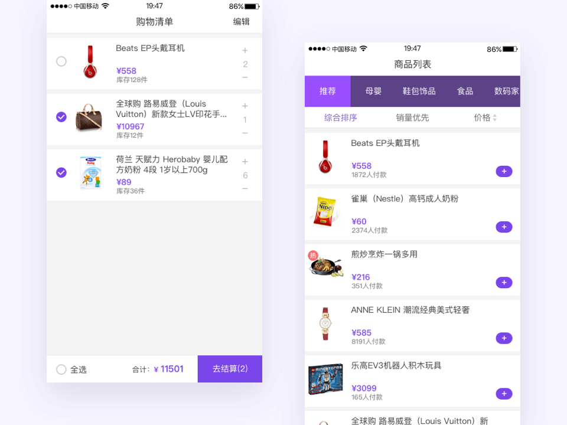

# Vue.js 购物车入门实战

## 介绍

> 通读官方教程 (guide) 的基础篇。不要用任何构建工具，就只用最简单的 `<script>`，把教程里的例子模仿一遍，理解用法。不推荐上来就直接用 vue-cli 构建项目，尤其是如果没有 Node/Webpack 基础。 
> 
> ——[《新手向：Vue 2.0 的建议学习顺序》](https://zhuanlan.zhihu.com/p/23134551)

初学vue，在了解了文档基础部分后就可以尝试做一些比官网示例更复杂一点的Demo了——比如这个购物车项目。

根据vue作者给新手的建议，这个项目直接在html中引入vue.js进行开发，无需考虑前端构建、模块化、ES6等部分知识。只用专注学习基本语法，把vue当作一个模版引擎来用就好了。

为什么选择购物车做示例呢？首先是因为它很常见，而且大家都对购物车的功能十分熟悉；其次，它的交互相对复杂，一个基本的购物车包括：选择商品、修改数量／属性、价格的计算，其中还包括判断库存、全选状态的联动等等。如果我们能搞定购物车，那么大部分的应用开发也不在话下了。

项目共 2 个页面：商品列表 和 购物清单。涉及列表展示、分类筛选、条件排序、购物车等电商项目常用的功能，尽可能覆盖到了Vue基础部分的所有知识点（模板语法、计算属性、样式绑定、条件渲染、列表渲染、事件处理），每段代码也有相应的注释以便参考。UI设计和交互也参考了天猫、京东的手机web端，尽量还原线上项目。

为了方便观察Vue的数据绑定，我将两个页面都写在了一个html文件中，不过它们分别有各自的vue实例。

如果你喜欢这个项目，别忘了在右上角 **star** 一下，非常感谢～

## 预览

### [Live demo](https://codepen.io/steveliao/pen/eEPwda)

## 功能

### 商品列表

- 分类筛选
- 根据销量、价格进行排序
- 添加到购物车

### 购物清单

- 商品的选择、全选
- 数量增减
- 计算总价
- 删除

## 总结

从读取数据并展示到列表（读）、把商品添加到购物车（增）、修改数量（改）再到删除选中的商品（删），一套流程下来后，对使用Vue来开发项目有了基本认识。在解决开发过程中遇到的问题时，也对Vue的数据绑定原理有了更深的认识。

虽然这个项目没有用到vue-cli，或者那些“高大上”的构建工具，但我始终认为javascript语言本身和各类前端框架的思想才是精髓，对于有追求和真正热爱前端的开发者来说，打好基础再去上手它们也不迟。

